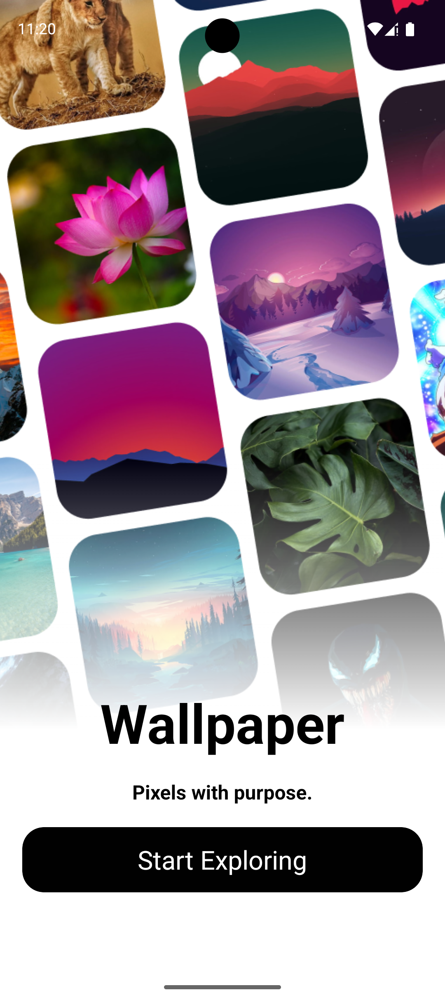
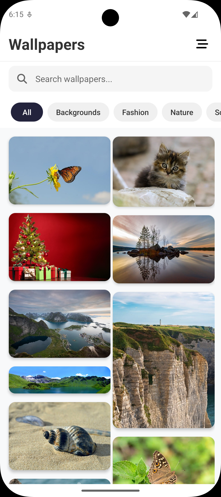
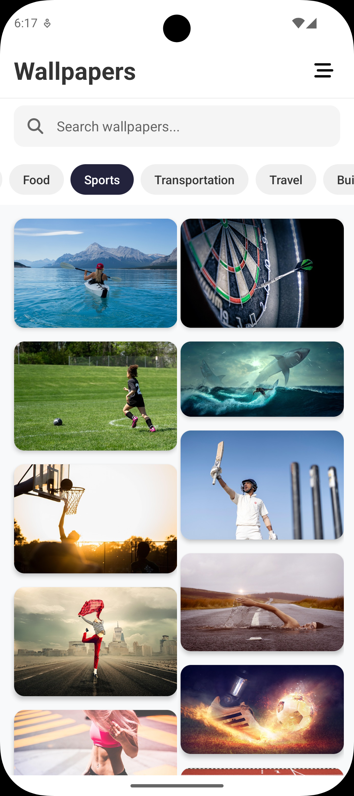
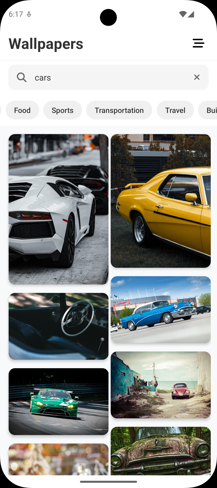

# 🖼️ Wallpaper App

A beautiful and performant React Native wallpaper app built with Expo, featuring infinite scroll, search functionality, and category filtering. Browse thousands of high-quality wallpapers from Pixabay with a smooth and modern user experience.

<div align="center">
  
  
  
  
</div>

## ✨ Features

- 🎨 **Modern UI Design** - Clean and intuitive interface with smooth animations
- 🔍 **Smart Search** - Search through millions of wallpapers with real-time results
- 📂 **Category Filter** - Browse wallpapers by categories (Nature, Fashion, Science, etc.)
- ♾️ **Infinite Scroll** - Smooth pagination with automatic loading
- 🔄 **Pull to Refresh** - Refresh content with a simple pull gesture
- 📱 **Responsive Layout** - Optimized for all device sizes
- ⚡ **Performance Optimized** - Built with FlashList for smooth scrolling
- 🌐 **High-Quality Images** - All images sourced from Pixabay API
- 📦 **Masonry Grid** - Pinterest-style layout for better visual appeal

## 🚀 Quick Start

### Prerequisites

- Node.js (v16 or higher)
- npm or yarn
- Expo CLI
- Android Studio (for Android) or Xcode (for iOS)

### Installation

1. **Clone the repository**
   ```bash
   git clone https://github.com/YashBhalodiya/wallpaper-app.git
   cd wallpaper-app
   ```

2. **Install dependencies**
   ```bash
   npm install
   ```

3. **Set up environment variables**
   ```bash
   cp .env.example .env
   ```

4. **Get your Pixabay API key**
   - Visit [Pixabay API Documentation](https://pixabay.com/api/docs/)
   - Sign up for a free account
   - Get your API key from the dashboard
   - Add it to your `.env` file:
   ```
   EXPO_PUBLIC_PIXABAY_API_KEY=your_actual_api_key_here
   ```

5. **Start the development server**
   ```bash
   npx expo start
   ```

6. **Run on your device**
   - Scan the QR code with Expo Go app (iOS/Android)
   - Or press `a` for Android emulator
   - Or press `i` for iOS simulator

## 📱 Tech Stack

- **Framework**: React Native with Expo
- **Navigation**: Expo Router
- **UI Components**: React Native core components
- **List Performance**: @shopify/flash-list (MasonryFlashList)
- **HTTP Client**: Axios
- **Icons**: @react-native-vector-icons/fontawesome6
- **State Management**: React Hooks (useState, useCallback, useEffect)
- **Image Loading**: React Native Image with optimizations

## 🏗️ Project Structure

```
wallpaper-app/
├── app/                     # Main app screens (Expo Router)
│   ├── index.tsx           # Home screen
│   └── _layout.tsx         # Root layout
├── src/
│   ├── components/         # Reusable UI components
│   │   ├── ImageCard.jsx   # Individual wallpaper card
│   │   ├── ImageGrid.jsx   # Masonry grid layout
│   │   ├── SearchBar.jsx   # Search input component
│   │   └── CategoryList.jsx # Category filter component
│   ├── hooks/              # Custom React hooks
│   │   └── useImages.js    # Image fetching and state management
│   ├── services/           # API and external services
│   │   └── api.js          # Pixabay API integration
│   ├── constants/          # App constants and configuration
│   │   └── config.js       # API config and UI constants
│   └── utils/              # Helper functions
│       └── helpers.js      # Utility functions
├── constants/              # Static data
│   ├── data.js            # Categories data
│   └── theme.js           # Theme configuration
├── assets/                 # Images, fonts, and other assets
└── .env.example           # Environment variables template
```

## 🔧 Configuration

### Environment Variables

Create a `.env` file in the root directory:

```bash
# Pixabay API Configuration
EXPO_PUBLIC_PIXABAY_API_KEY=your_pixabay_api_key_here
```

### API Configuration

The app uses Pixabay API with the following default settings:
- **Images per page**: 10 (configurable)
- **Safe search**: Enabled
- **Editor's choice**: Prioritized
- **Minimum resolution**: 640x640
- **Image type**: Photos only

## 🎯 Key Features Breakdown

### Smart Search
- Real-time search with debouncing
- Search across all image metadata
- Clear search functionality
- Search history (coming soon)

### Category Filtering
20+ categories including:
- Backgrounds, Nature, Fashion
- Science, Education, People
- Animals, Travel, Food
- Sports, Technology, and more

### Performance Optimizations
- **React.memo** for component memoization
- **useCallback** for function memoization
- **FlashList** for efficient list rendering
- **Image lazy loading** with preview thumbnails
- **Pagination** with automatic loading

### User Experience
- **Pull-to-refresh** functionality
- **Loading states** and error handling
- **Empty states** with helpful messages
- **Smooth animations** and transitions
- **Responsive design** for all screen sizes

## 🧪 Available Scripts

```bash
# Start the development server
npm start

# Start with clear cache
npm start -- --clear

# Run on Android
npm run android

# Run on iOS
npm run ios

# Run on web
npm run web

# Run linter
npm run lint

# Reset project to blank state
npm run reset-project
```

## 📱 Supported Platforms

- ✅ iOS (iPhone/iPad)
- ✅ Android (Phone/Tablet)
- ⚠️ Web (Limited support)

## 🤝 Contributing

1. Fork the repository
2. Create your feature branch (`git checkout -b feature/AmazingFeature`)
3. Commit your changes (`git commit -m 'Add some AmazingFeature'`)
4. Push to the branch (`git push origin feature/AmazingFeature`)
5. Open a Pull Request

## 📄 License

This project is licensed under the MIT License - see the [LICENSE](LICENSE) file for details.

## 🙏 Acknowledgments

- [Pixabay](https://pixabay.com/) for providing free high-quality images
- [Expo](https://expo.dev/) for the amazing development platform
- [@shopify/flash-list](https://github.com/Shopify/flash-list) for performant list rendering
- [React Native Vector Icons](https://github.com/oblador/react-native-vector-icons) for beautiful icons

## 📞 Support

If you encounter any issues or have questions:

1. Check the [Issues](https://github.com/YashBhalodiya/wallpaper-app/issues) page
2. Create a new issue with detailed information
3. Provide device information and error logs

---

<div align="center">
  <p>Made with React Native and Expo</p>
  <p>⭐ Star this repo if you found it helpful!</p>
</div>

## Join the community

Join our community of developers creating universal apps.

- [Expo on GitHub](https://github.com/expo/expo): View our open source platform and contribute.
- [Discord community](https://chat.expo.dev): Chat with Expo users and ask questions.
